<h1 align="center">🔳 RISC-V SoC Tapeout Program — Week 5️⃣</h1>

<p align="center">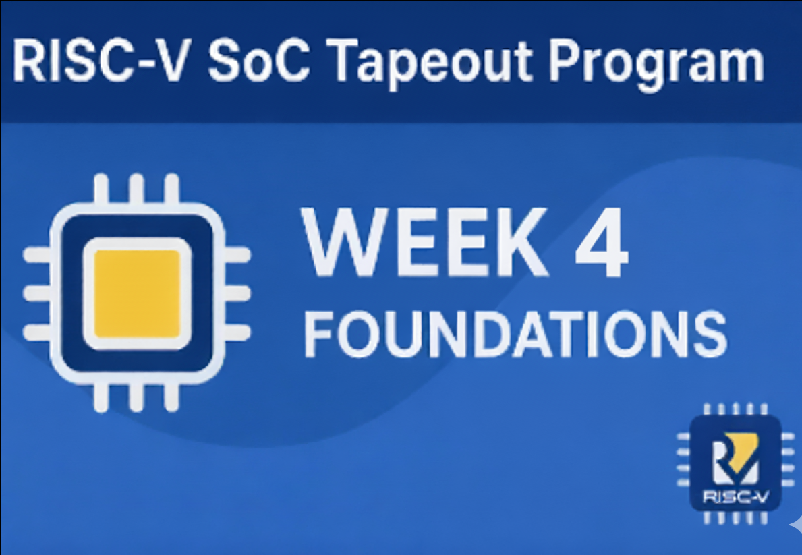</p>

---

<div align="center">

# 🚀 Week 5 — OpenROAD Flow Setup, Floorplan & Placement

🌟 This is **Week 5** of the **VSD RISC-V SoC Tapeout Program** —  
I transitioned from **SPICE-level transistor design (Week 4)** to **backend physical implementation** using **OpenROAD**.  
I explored the **OpenROAD-Flow-Scripts (ORFS)** setup, performed **floorplanning and placement**,  
and understood how **logical netlists are transformed into physical layouts**.

</div>

---


OpenROAD automates all backend stages of VLSI physical design, including:

➡️ Logic synthesis

➡️ Floorplanning

➡️ Placement

➡️ Clock-Tree Synthesis (CTS)

➡️ Routing

➡️ Final GDSII layout generation

---

## 🎯 Objectives

- Install and configure **OpenROAD Flow Scripts (ORFS)**.
- Perform **Floorplan + Placement** runs successfully.
- Understand how logical netlists map to physical layouts.
- Troubleshoot build and dependency errors effectively.

---

## ⚙️ Step-by-Step Installation

### 🧩 Step 1 — Clone the Repository

```bash
git clone --recursive https://github.com/The-OpenROAD-Project/OpenROAD-flow-scripts
cd OpenROAD-flow-scripts
```
<p align="center">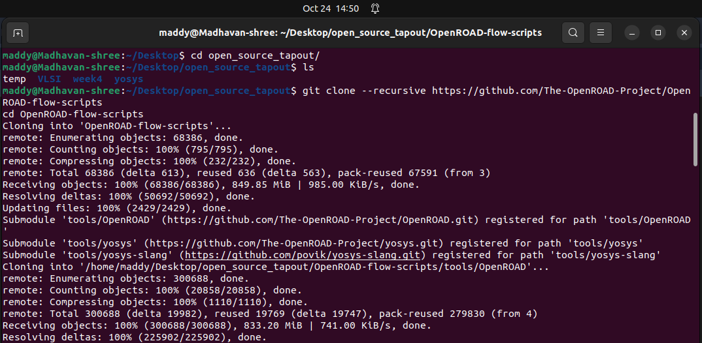</p>

<p align="center">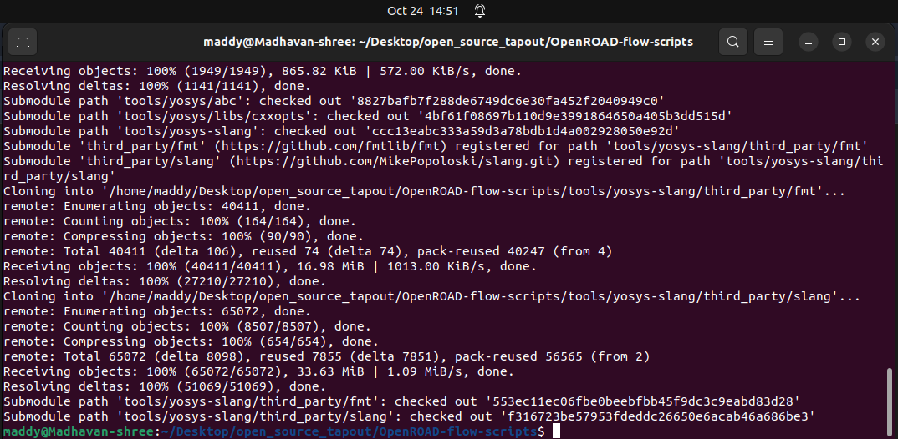</p>


### 🗂 Directory Map of the OpenROAD-flow-scripts

```
~/Desktop/OpenROAD_Week5/
├── OpenROAD-flow-scripts          → Main OpenROAD flow repository
│   ├── bazel                      → Build system support
│   ├── build_openroad.sh          → Script to build OpenROAD locally
│   ├── dependencies               → Third-party dependency setup scripts
│   ├── docker                     → Docker build configurations
│   ├── docs                       → Documentation and setup info
│   ├── flow                       → Flow scripts for PnR stages
│   ├── tools                      → Contains tool submodules
│   │   ├── AutoTuner              → Automated tuning tool
│   │   ├── install                → Dependency installation helpers
│   │   ├── OpenROAD               → ⚙️ Main OpenROAD source directory
│   │   │   ├── CMakeLists.txt     → ✅ Edit this file to fix the build issue
│   │   │   ├── src                → OpenROAD source code (C++ modules)
│   │   │   ├── third-party        → Third-party libraries (e.g., OpenSTA, Boost)
│   │   │   ├── include            → Header files
│   │   │   ├── cmake              → CMake helper scripts
│   │   │   ├── docs               → Documentation
│   │   │   ├── test               → (Disabled) Test modules
│   │   │   ├── etc, docker, jenkins → Build/config files
│   │   │   └── WORKSPACE          → Bazel workspace file
│   │   ├── yosys                  → Yosys logic synthesis tool
│   │   ├── yosys-slang            → Yosys slang front-end
│   │   └── yosys_util             → Utility scripts for yosys
│   ├── etc, env.sh, setup.sh      → Environment setup and configuration
│   └── build.log / build_openroad.log → Build output logs
├── spdlog                         → Logging dependency (external)
└── or-tools                       → Google OR-Tools for optimization

```

---

### ⚡ Step 2 — Run the Setup Script

```bash
sudo ./setup.sh

```
<p align="center">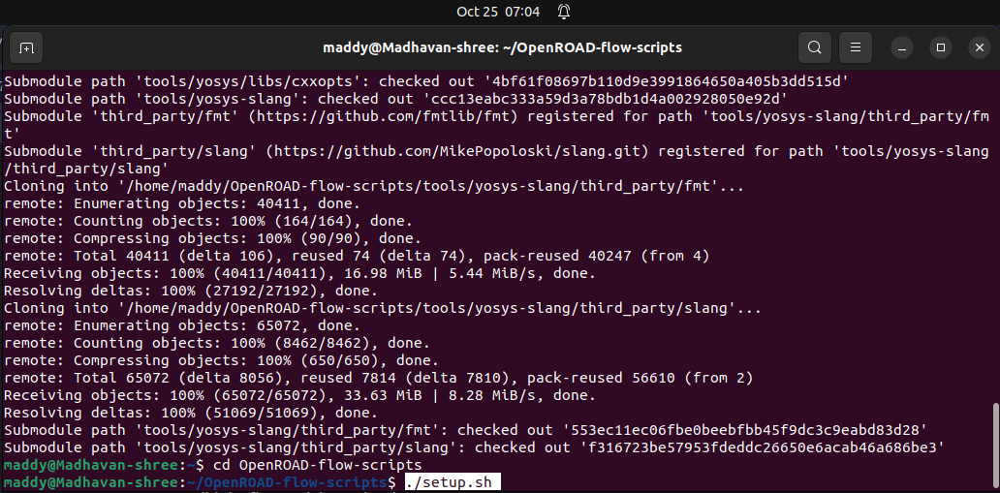</p>

This installs all major dependencies (Yosys, Magic, Netgen, etc.).

🖼️ Example:

<p align="center">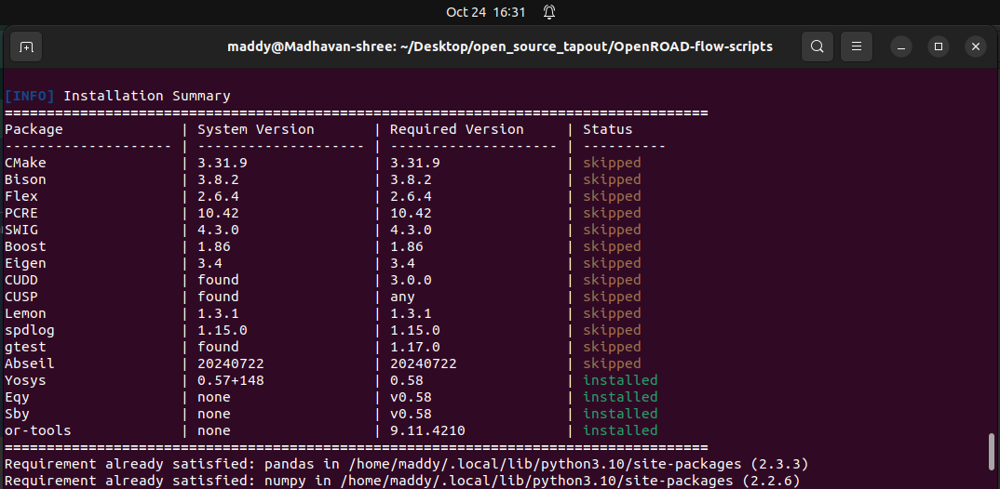</p>


---

### 🛠️ Step 3 — Build OpenROAD

```bash
./build_openroad.sh --local

```
<p align="center">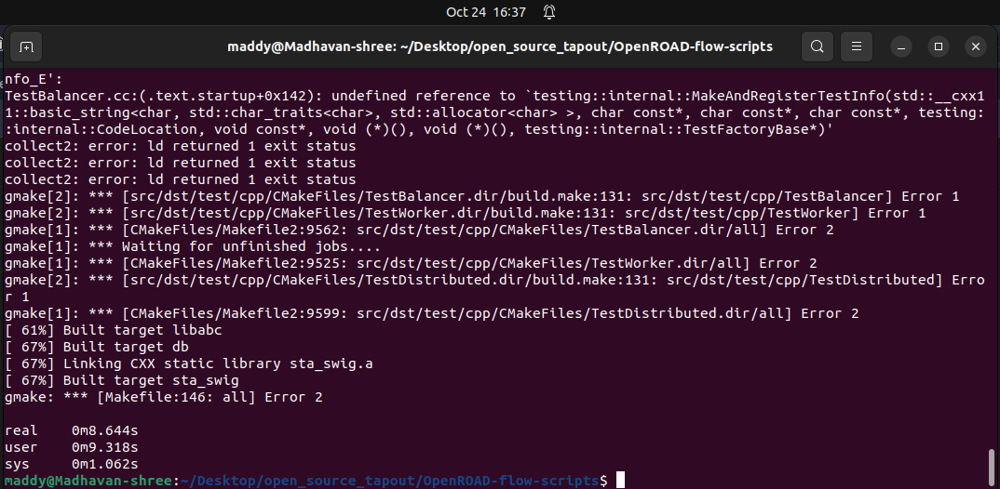</p>


---

## ⚠️ Error Correction — Build Stuck at ~67 %

During the build process, the compilation may stop around **67 %** due to conflicting CMake test targets or GPU definitions.

To fix this:

### 🪜 Steps to Resolve

1️⃣ Navigate to the OpenROAD source directory inside your flow scripts:

```bash
cd ~/Desktop/OpenROAD_Week5/OpenROAD-flow-scripts/tools/OpenROAD

```

2️⃣ Open and edit `CMakeLists.txt`:

```bash
nano CMakeLists.txt

```

3️⃣ Replace the file contents with this **patched version** (disables tests and ensures GPU flags are properly handled):

```
# SPDX-License-Identifier: BSD-3-Clause
# Copyright (c) 2019-2025, The OpenROAD Authors

cmake_minimum_required (VERSION 3.16)

# Use standard target names
cmake_policy(SET CMP0078 NEW)
cmake_policy(SET CMP0086 NEW)
cmake_policy(SET CMP0074 NEW)
cmake_policy(SET CMP0071 NEW)
cmake_policy(SET CMP0077 NEW)

# Interfers with Qt so off by default.
option(LINK_TIME_OPTIMIZATION "Flag to control link time optimization: off by default" OFF)
if (LINK_TIME_OPTIMIZATION)
  set(CMAKE_INTERPROCEDURAL_OPTIMIZATION TRUE)
endif()

# Allow to use external shared boost libraries
option(USE_SYSTEM_BOOST "Use system shared Boost libraries" OFF)

# Allow to use external shared opensta libraries
option(USE_SYSTEM_OPENSTA "Use system shared OpenSTA library" OFF)

# Allow to use external shared abc libraries
option(USE_SYSTEM_ABC "Use system shared ABC library" OFF)

# Disable tests completely
set(ENABLE_TESTS OFF)

# Sanitizer options (disabled by default)
option(ASAN "Enable Address Sanitizer" OFF)
option(TSAN "Enable Thread Sanitizer" OFF)
option(UBSAN "Enable Undefined Behavior Sanitizer" OFF)

project(OpenROAD VERSION 1 LANGUAGES CXX)

set(OPENROAD_HOME ${PROJECT_SOURCE_DIR})
set(OPENROAD_SHARE ${CMAKE_INSTALL_PREFIX}/share/openroad)

set(CMAKE_CXX_STANDARD 17 CACHE STRING "the C++ standard to use for this project")
set(CMAKE_CXX_STANDARD_REQUIRED ON)
set(CMAKE_CXX_EXTENSIONS OFF)

list(APPEND CMAKE_MODULE_PATH "${CMAKE_CURRENT_SOURCE_DIR}/cmake")

# Get version string in OPENROAD_VERSION
if(NOT OPENROAD_VERSION)
  include(GetGitRevisionDescription)
  git_describe(OPENROAD_VERSION)
  string(FIND ${OPENROAD_VERSION} "NOTFOUND" GIT_DESCRIBE_NOTFOUND)
  if(${GIT_DESCRIBE_NOTFOUND} GREATER -1)
    message(WARNING "OpenROAD git describe failed, using sha1 instead")
    get_git_head_revision(GIT_REFSPEC OPENROAD_VERSION)
  endif()
endif()

message(STATUS "OpenROAD version: ${OPENROAD_VERSION}")

# Default to building optimized/release executable
if(NOT CMAKE_BUILD_TYPE)
  set(CMAKE_BUILD_TYPE RELEASE)
endif()

if(CMAKE_CXX_COMPILER_ID STREQUAL "GNU")
  if(CMAKE_CXX_COMPILER_VERSION VERSION_LESS "8.3.0")
    message(FATAL_ERROR "Insufficient gcc version. Found ${CMAKE_CXX_COMPILER_VERSION}, but require >= 8.3.0.")
  endif()
elseif(CMAKE_CXX_COMPILER_ID STREQUAL "Clang")
  if(CMAKE_CXX_COMPILER_VERSION VERSION_LESS "7.0.0")
    message(FATAL_ERROR "Insufficient Clang version. Found ${CMAKE_CXX_COMPILER_VERSION}, but require >= 7.0.0.")
  endif()
elseif(CMAKE_CXX_COMPILER_ID STREQUAL "AppleClang")
  if(CMAKE_CXX_COMPILER_VERSION VERSION_LESS "12.0.0")
    message(FATAL_ERROR "Insufficient AppleClang version. Found ${CMAKE_CXX_COMPILER_VERSION}, but require >= 12.0.0.")
  endif()
else()
  message(WARNING "Compiler ${CMAKE_CXX_COMPILER_ID} is not officially supported.")
endif()

message(STATUS "System name: ${CMAKE_SYSTEM_NAME}")
message(STATUS "Compiler: ${CMAKE_CXX_COMPILER_ID} ${CMAKE_CXX_COMPILER_VERSION}")
message(STATUS "Build type: ${CMAKE_BUILD_TYPE}")
message(STATUS "Install prefix: ${CMAKE_INSTALL_PREFIX}")
message(STATUS "C++ Standard: ${CMAKE_CXX_STANDARD}")
message(STATUS "C++ Standard Required: ${CMAKE_CXX_STANDARD_REQUIRED}")
message(STATUS "C++ Extensions: ${CMAKE_CXX_EXTENSIONS}")

# Configure version header
configure_file(
  ${OPENROAD_HOME}/include/ord/Version.hh.cmake
  ${OPENROAD_HOME}/include/ord/Version.hh
)

################################################################
if (CMAKE_CXX_COMPILER_ID STREQUAL "GNU" AND CMAKE_CXX_COMPILER_VERSION VERSION_LESS "9.1")
  MESSAGE(STATUS "Older version of GCC detected. Linking against stdc++fs")
  link_libraries(stdc++fs)
endif()

set(CMAKE_EXPORT_COMPILE_COMMANDS 1)

add_subdirectory(third-party)

# Disable tests entirely
# (removed add_custom_target(build_and_test) and GoogleTest include)
add_subdirectory(src)
# add_subdirectory(test)

target_compile_definitions(openroad PRIVATE GPU)

if(BUILD_PYTHON)
  target_compile_definitions(openroad PRIVATE BUILD_PYTHON=1)
else()
  target_compile_definitions(openroad PRIVATE BUILD_PYTHON=0)
endif()

if(BUILD_GUI)
  target_compile_definitions(openroad PRIVATE BUILD_GUI=1)
else()
  target_compile_definitions(openroad PRIVATE BUILD_GUI=0)
endif()

####################################################################
# Build man pages (Optional)
option(BUILD_MAN "Enable building man pages" OFF)

if(BUILD_MAN)
  message(STATUS "man is enabled")
  include(ProcessorCount)
  ProcessorCount(PROCESSOR_COUNT)
  message(STATUS "Number of processor cores: ${PROCESSOR_COUNT}")
  add_custom_target(
    man_page ALL
    COMMAND make clean && make preprocess && make all -j${PROCESSOR_COUNT}
    WORKING_DIRECTORY ${OPENROAD_HOME}/docs
  )
  install(DIRECTORY ${OPENROAD_HOME}/docs/cat DESTINATION ${OPENROAD_SHARE}/man)
  install(DIRECTORY ${OPENROAD_HOME}/docs/html DESTINATION ${OPENROAD_SHARE}/man)
endif()

####################################################################
set(CMAKE_CXX_FLAGS_RELEASEWITHASSERTS "${CMAKE_CXX_FLAGS_RELEASE} -UNDEBUG" CACHE STRING "" FORCE)
set(CMAKE_C_FLAGS_RELEASEWITHASSERTS "${CMAKE_C_FLAGS_RELEASE} -UNDEBUG" CACHE STRING "" FORCE)

```

4️⃣ Save and exit (Ctrl + O, Enter, Ctrl + X).


5️⃣ Return to your main directory and rebuild:

```bash
cd ~/Desktop/OpenROAD_Week5/OpenROAD-flow-scripts
./build_openroad.sh --local

```


<p align="center">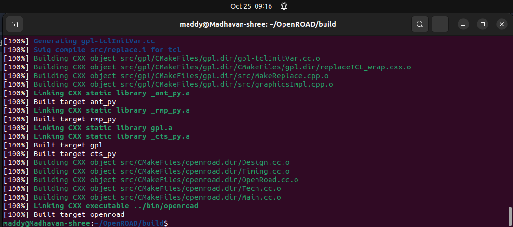</p>

<p align="center">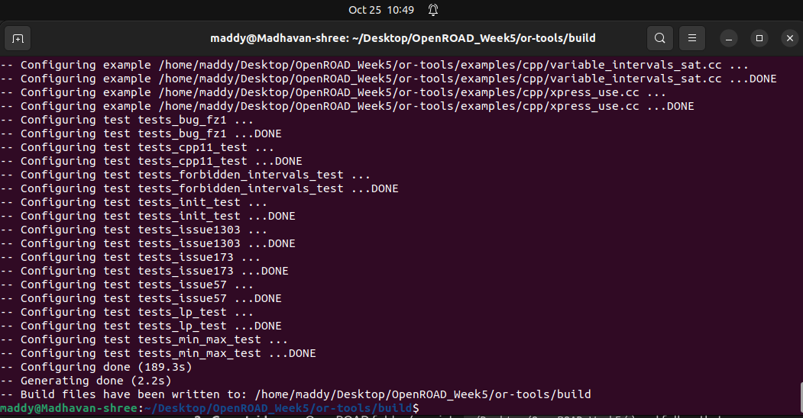</p>


✅ This fixes the 67 % halt issue and completes the build successfully.

---

### 🔍 Step 4 — Verify Installation

```bash
source ./env.sh
yosys -help
openroad -help

```
<p align="center">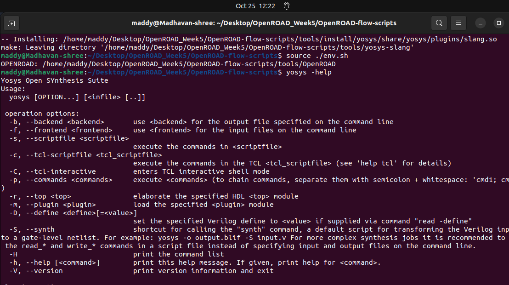</p>

<p align="center">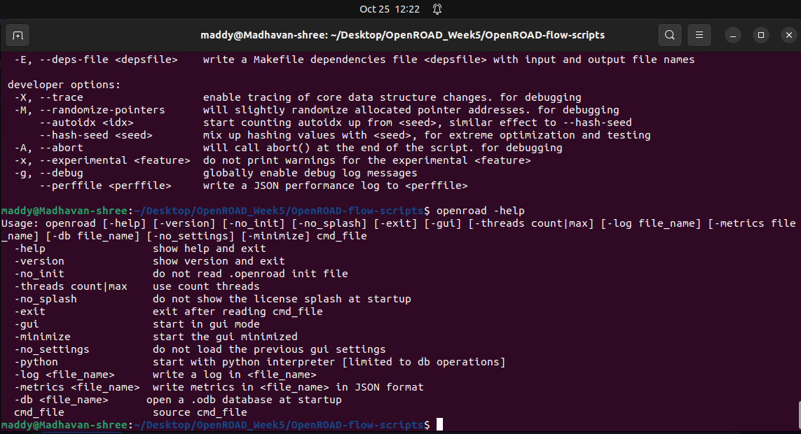</p>


---

### 🧪 Step 5 — Run the Flow

```bash
cd flow
make

```

This executes the default test flow and generates floorplan + placement results.
<p align="center">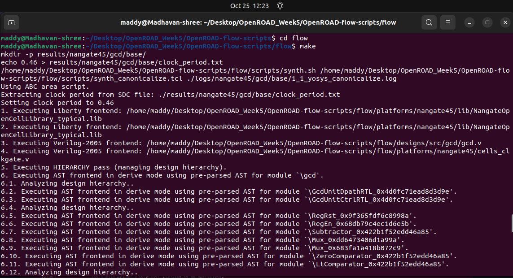</p>

<p align="center">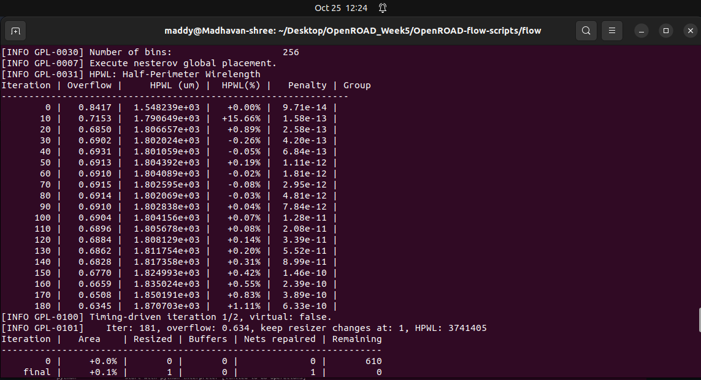</p>

<p align="center">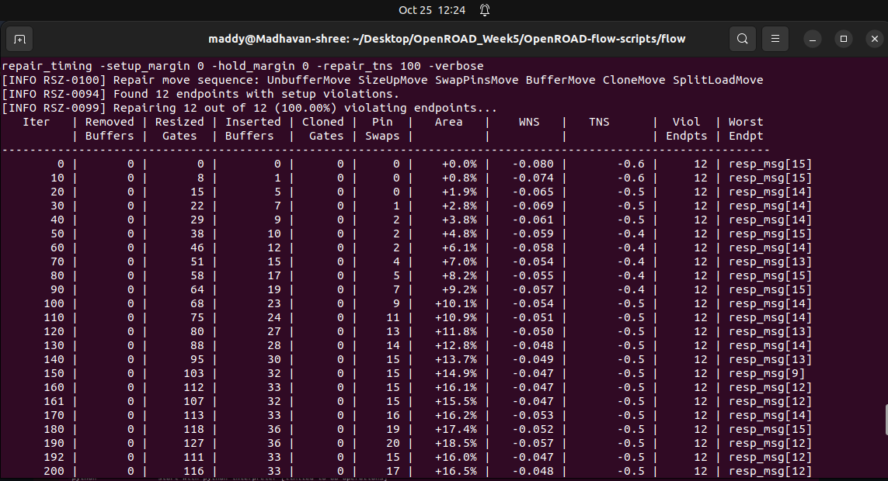</p>


<p align="center">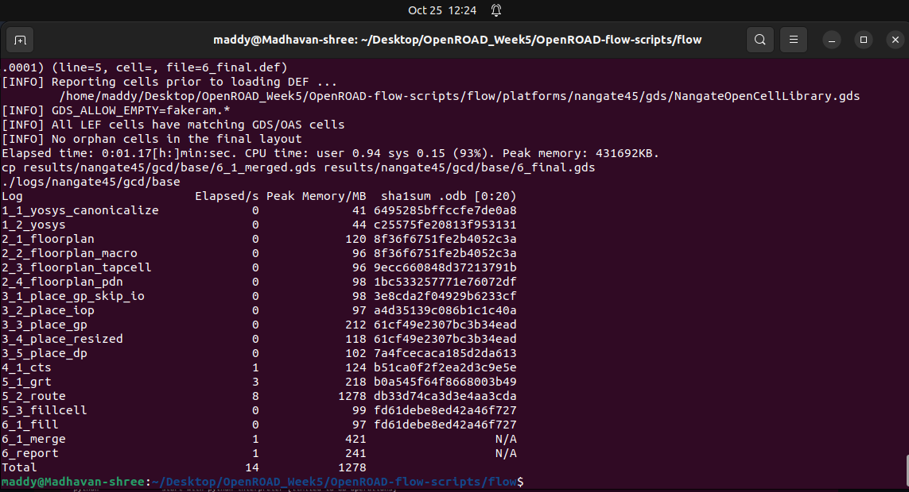</p>

---

### 🖥️ Step 6 — Launch the GUI

```bash
make gui_final

```

Opens the OpenROAD GUI to visualize layout.
<p align="center">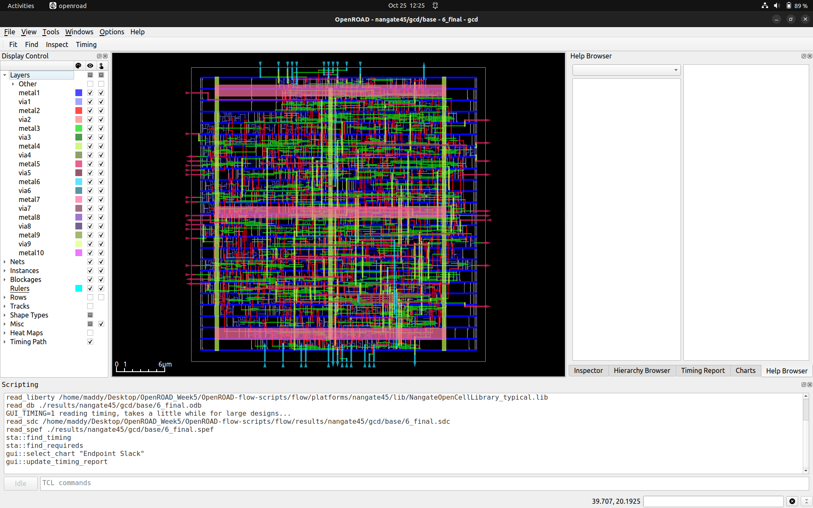</p>

<p align="center">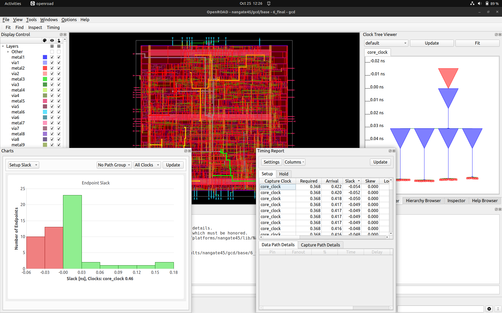</p>


---

## 📁 ORFS Directory Structure

```
OpenROAD-flow-scripts/
├── docker        → Docker-based setup
├── docs          → Documentation
├── flow          → Core RTL-to-GDSII flow
├── jenkins       → Regression tests
├── tools         → Tool sources and binaries
├── etc           → Dependency scripts
├── setup_env.sh  → Environment setup script

```

Inside `flow/` directory:

```
├── design     → Example test designs
├── platform   → Technology libraries (LEF, GDS, etc.)
├── makefile   → Flow automation rules
├── scripts    → Stage-specific flow scripts
├── tutorials  → Example learning designs
├── util       → Utility functions

```

---

## 🧾 Outcome Summary

✅ Successfully installed **OpenROAD Flow Scripts**

✅ Resolved build-halt issue (~67 %) by modifying `CMakeLists.txt`

✅ Verified tool execution (Yosys + OpenROAD help)

✅ Ran floorplan + placement stages

✅ Explored GUI for layout visualization

---


## 📒 Key Learnings — Week 5

### 🧩 OpenROAD Flow Setup, Build & Automation

---

### **📌** Environment Configuration & Dependency Setup

- Installed and configured complete **OpenROAD-flow-scripts** environment
- Ensured proper installation of dependencies including:
    
    ✅ `build-essential`, `cmake`, `tcl`, `libx11-dev`, `libxrender1`, `libxext6`
    
- Verified **gcc**, **g++**, and **make** versions for build compatibility
- Cloned repository and initialized submodules for consistent flow structure

---

### **📌** OpenROAD Compilation & Build Process

- Navigated to `OpenROAD-flow-scripts` directory
- Successfully executed build process using:
    
    ```
    ./build_openroad.sh --local
    
    ```
    
- Debugged issues related to missing `spdlog`, `gtest`, and path errors
- Verified successful build by generating the OpenROAD binary in `build/src/openroad`
- Confirmed tool access with:
    
    ```
    ./build/src/openroad --version
    
    ```
    

---

### **📌** Understanding OpenROAD Architecture

- Studied hierarchical flow of **RTL-to-GDS** automation
- Explored integration of:
    - `Yosys` for synthesis
    - `OpenSTA` for timing analysis
    - `TritonFloorplan`, `TritonCTS`, and `TritonRoute` for layout steps
- Learned about OpenROAD’s Tcl-based scripting environment and flow templates

---

### **📌** Flow Customization & Configuration

- Edited configuration files inside `flow/designs/sky130hd/`
- Updated parameters such as `DESIGN_NAME`, `VERILOG_FILES`, `CLOCK_PORT`, and `CLOCK_PERIOD`
- Understood directory structure:
    - `flow/designs/` → User design setup
    - `flow/results/` → Final GDSII outputs
    - `flow/logs/` → Step-by-step execution logs

---

### **📌** Debugging Build & Log Issues

- Encountered errors such as:
    
    ❌ Missing `build.log` file
    
    ❌ Non-existent `/usr/src/gtest` directory
    
- Fixed by installing required test packages and re-running `make`
- Validated build completion by checking installation paths and executable presence

---

### **📌** Toolchain Verification

- Verified OpenROAD functionality with simple test runs
- Analyzed default design runs for timing, floorplan, and placement stages
- Observed structured outputs in `logs/`, `reports/`, and `results/` directories

---

### 🛠️ Tools in Action

✔ OpenROAD → Full RTL-to-GDS flow automation

✔ Yosys → Logic synthesis integration

✔ OpenSTA → Static timing verification

✔ TritonTools → Floorplan, placement, CTS, and routing

✔ Sky130 PDK → Physical library support

---

> 💡 “Week 5 was the bridge between design theory and physical implementation — setting up OpenROAD from scratch, debugging builds, and finally witnessing the open-source flow automate the complete SoC layout journey.” 🚀
>


---
## 🙏 Special Thanks 👏  
I sincerely thank all the organizations and their key members for making this program possible 💡:  

- 🧑‍🏫 **VLSI System Design (VSD)** – [Kunal Ghosh](https://www.linkedin.com/in/kunal-ghosh-vlsisystemdesign-com-28084836/) for mentorship and vision.  
- 🤝 **Efabless** – [Michael Wishart](https://www.linkedin.com/in/mike-wishart-81480612/) & [Mohamed Kassem](https://www.linkedin.com/in/mkkassem/) for enabling collaborative open-source chip design.  
- 🏭 **[Semiconductor Laboratory (SCL)](https://www.scl.gov.in/)** – for PDK & foundry support.  
- 🎓 **[IIT Gandhinagar (IITGN)](https://www.linkedin.com/school/indian-institute-of-technology-gandhinagar-iitgn-/?originalSubdomain=in)** – for on-site training & project facilitation.  
- 🛠️ **Synopsys** – [Sassine Ghazi](https://www.linkedin.com/in/sassine-ghazi/) for providing industry-grade EDA tools under C2S program.  

--- 
👉 Main Repo Link :  
[https://github.com/madhavanshree2006/RISC-V-SoC-Tapeout-Program](https://github.com/madhavanshree2006/RISC-V-SoC-Tapeout-Program)
